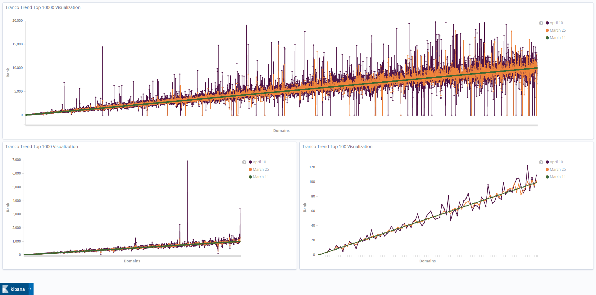

# Crawling and Analyzing Top 1 Million Domains

## Introduction
This is a a research project that uses the top 1 million list of domains from three data sources namely Majestic, Alexa, and Tranco to apply a set of security metrics and visualise the results of that analysis along with an analysis of the change in popularity of domains over a period of 30 days. Another goal for the project was to provide a tool to enumerate sub-domains in an efficient way, without compromising on quality results.

## Implementation
The aforementioned goals were achieved using various python programs, the details about which are mentioned below -
(For each define number of days and detail on implementation)

### Security Metrics
Many different options were considered before narrowing down to the adoption of the technologies/protocols given below, which were used as the fundamental set of security metrics to analyse the 1 million domains list.

#### HTTP 2.0 adoption
The Application Layer Protocol Negotiation extension is used to negotiate what protocol should be used for a secure connection over the application layer. A set of protocols were used for the negotiation using python sockets. These were `h2`, which corresponds to the protocol in concern i.e., HTTP/2.0; `spdy/3`, which is the implementation by google based on which HTTP/2.0 was standardised; and `http/1.1`, which is the most commonly used HTTP/1.1 protocol. The negotiated session was checked and flagged for all domains that supported `h2` and this is the methodology used to analyse the adoption of HTTP/2.0 by top 1 million domains.

#### IPv6 adoption
The python module `dnspython` was used to resolve the AAAA record for the domain names. All domains for which an address could be resolved were considered positive for the adoption of IPv6 addrresses. 

#### TLS adoption
A default connection was made to the domains using the `ssl` module in python, for a successful tls certificate based connection. The secure socket version was then used to mark the version of TLS in use by the domain.

### Sub domain enumeration
A tool was created to help in vulnerability assessment by enumerating subdomains for any given domain, be it in a local network environment or in the public internet. A solid focus is laid on a) faster enumeration times, b) well-formatted outputs. The tool uses many methods for the enumeration, which include -
1. Extraction from Certificate Transparency logs by querying crt.sh.
2. VirusTotal and ThreatCrowd passive subdomain extraction.
3. Subject Alternate Name entries in X.509 certificates by extraction from `openssl` module in python.
4. Search Engine Queries - Extracting subdomains from the results of Netcraft and Yahoo Search Engines.
5. DNS queries for mail server names.
6. Webpage content Dictionary - This is the most novel method used for the tool, which parses the content of the webpage served by the domain and stores a list of found subdomains. This list is again traversed and the webpages parsed for further subdomain enumeration. This is done for Breadth first level 2, which gives most optimal results. This also allows the tool to discover subdomains in local unexposed testing network environments. 

This tool uses parallel processing to increase efficiency and is the most efficient tool for a perfectly formatted output of an enumeration of subdomains.

### Trend Analysis
The popularity of domains was analysed over a period of 30 days, where top 1 million lists were pulled each day. To do this, the rankings of the domains were taken as a base scale. Then, the changes to those ranks were monitored in the subsequent days to present a visualisation.

## Challenges encountered
The main challenges encountered for the analysis of security metrics, trends and subdomain enumeration were - 
1. A quality network with fast connections to domain servers around the globe - Many platforms such as GCP, AWS, Kaggle and Google Colab were tested for network performance. The fastest performance was obtained on Google Colab, which was used for all network based testing.
2. Massive amounts of requests for subdomain enumeration were denied being from the same server (of Google Colab) - Many rotating proxy lists were tested, however, no proxy list was fast enough to produce satisfactory results. Therefore, multiple Google Colab accounts, a local script and a script on an AWS cloud machine were used to reduce the number of denied requests. 
3. Less amount of data for trend analysis - Trend analysis of domains over a short period of 30 days is very localised and does not show long term behaviour or shift in popularity of any domain.

## Results
### Results of Security Metrics Analysis
Tranco data was used to generate results for these 3 security metrics. The result was stored in Elasticsearh database and Kibana dashboard is used to visualize the results as shown below. HTTP/2.0 adoption results were either `yes`, `no`, or `error`. IPv6 adoption results were same as HTTP/2.0 adoption results. TLS adoption results were either `TLS version` or `error`.

### Trend Analysis
The popularity of `20,000` domains were analyzed over period of one month for all three data sources, Majestic, Alexa, and Tranco. The results were stored in Elasticsearch and Kibana wa sused for visualizations as shown below. The results are shown for 3 dates, March 11, March 25, and April 10. There are three graphs per data source, Top 100 domains, Top 1000 domains, and Top 10000 domains.

 

### Results of Sub Domain Enumeration
The presented tool is one of the most efficient active scanning sub domain enumeration scripts and can produce large number of sub domains in short spans of time. As an example, a complete run on the domain `stanford.edu` resulted in a total of `1746` subdomains in a short span of `25.91` seconds.

The visualization below shows the number of sub domains per domain for Top 100 domains using Kibana dashboard.

## Conclusion
The results from the graphs showed us that there were notable differences between rankings of domains in the span of one month for all three data sources (Majestic, Alexa, and Tranco). The security metrics results shows us how many domains employed HTTP/2.0, IPv6 and TLS version. There were considerable amount of domains that had no HTTP/2.0 adoption, no IPv6 adoption, using TLSv1.2 and some still using TLSv1.1.  

There are many additions that can be thought of as future work. One such addition is finding out more security metrics that can be computed for domains. We could find only three metric keeping both legal and ethical issues in mind.  Moreover, computation for DoH metric was attempted, but was not successful within the time frame. We hope to find more metrics in future and also analyze data for more period of time.

## Contributors
- [Apurv Singh Gautam](https://apurvsinghgautam.me)
- [Gabriel Siewert](https://www.linkedin.com/in/gabriel-siewert-bb7511199/)
- [Maneel Modi](https://www.linkedin.com/in/maneel-modi/)
- [Rahul Saranjame](https://www.linkedin.com/in/rahulsaranjame/)
- [Tanishq Rupaal](https://tanq16.github.io/)

